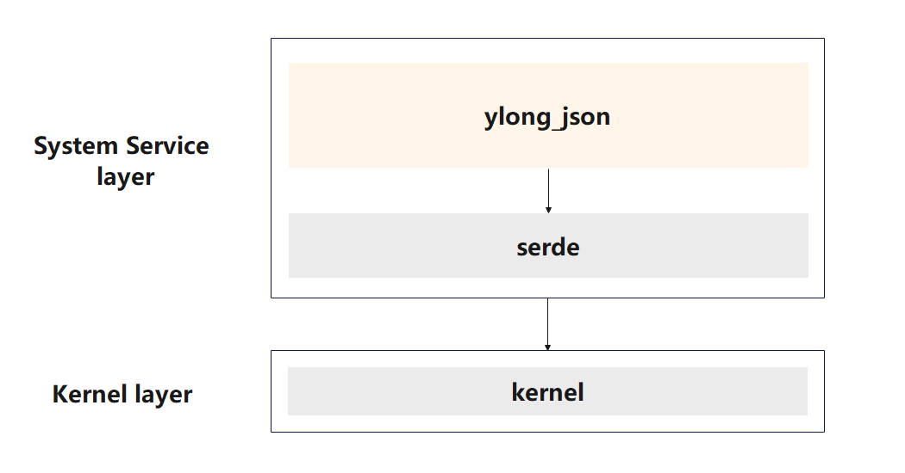
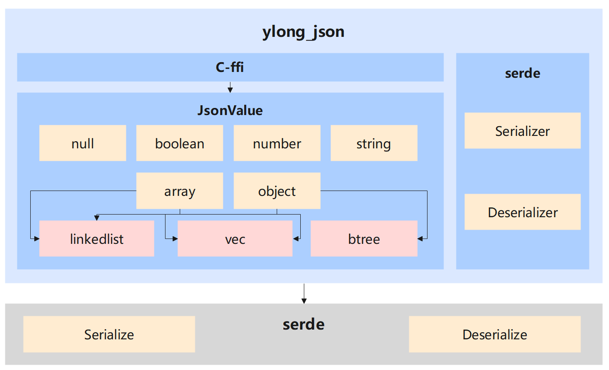

# ylong_json

## 简介
`ylong_json` 模块提供了 JSON 语法格式文本或字符串的序列化功能，以及对应生成实例的反序列化功能。

### ylong_json 在 Openharmony 中的位置

以下是对于上图关键字段的描述信息：
- `ylong_json`：提供 `json` 序列化与反序列化能力的系统组件
- `serde`：第三方库，用于高效、通用地序列化和反序列化 `Rust` 数据结构。

### ylong_json 内部架构图

`ylong_json` 内部主要分为两个模块，以自定义 `JsonValue` 类型为核心的模块和适配第三方库 `serde` 的模块。

1. `JsonValue` 是 `ylong_json` 内部自定义的结构类型，以该结构为核心构建 `json` 的序列化与反序列化功能。
- `JsonValue` ：核心结构类型，存储 `json` 内容信息，共有 6 种枚举类型变体。
- `LinkedList`, `Vec`, `BTreeMap`：`Array` 与 `Object` 内部数据存储的三种方式，通过 `features` 选择。
- 序列化功能：支持将 `JsonValue` 实例输出为紧凑型字符串或写到输出流中。
- 反序列化功能：支持解析 `json` 文本或输入流中的 `json` 内容并生成 `JsonValue` 实例。

2. `ylong_json` 适配了第三方库 `serde` 
- `Serializer`：序列化输出的辅助结构类型。
- `Deserializer`：反序列化输出的辅助结构类型。
- 序列化功能：支持将实现了 `serde::Serialize` trait 的类型实例序列化为 `json` 文本内容或将内容写到输出流中。
- 反序列化功能：若实现了 `serde::Deserialize` trait 的类型在 `json` 内容中，则可将该部分 `json` 内容反序列化为该类型的实例。

## 目录
```
ylong_json
├─ benches                                # benche 测试文件
├─ docs                                   # 说明文档
├─ examples                               # ylong_json 代码示例
├─ figures                                # ylong_json 架构图
├─ patches                                # patches 相关信息
├─ src
│  ├─ value                               # Array, Object 类型定义和相关方法实现
│  ├─ adapter.rs                          # 适配 C 的接口实现
│  ├─ consts.rs                           # 一些常数与表格的定义
│  ├─ deserializer.rs                     # 适配 serde 的反序列化实现
│  ├─ encoder.rs                          # 为 JsonValue 类型序列化实现
│  ├─ error.rs                            # 错误类型定义，便于定位
│  ├─ link_list.rs                        # LinkedList 类型定义和相关方法实现
│  ├─ serializer_compact.rs               # 适配 serde 的序列化实现
│  ├─ states.rs                           # 为 JsonValue 类型反序列化实现
│  └─ value.rs                            # JsonValue 类型定义和相关方法实现
└─ tests                                  # 测试目录
```

## 编译构建

### 使用 Cargo 编译 
1. 在 `Cargo.toml` 的依赖中添加 `ylong_json`
```toml
[dependencies]
ylong_json = { git = "https://gitee.com/openharmony-sig/commonlibrary_rust_ylong_json.git" }
```

### 使用 GN 编译
1. 在 `bundle.json` 中添加 `ylong_json`
```gn 
“deps”： {
    “components”: ["ylong_json"]
}
```

2. 在 `BUILD.gn` 中添加 `ylong_json:lib`
```gn 
external_deps = ["ylong_json:lib"]
```

## 用户指南
详情内容请见[用户指南](./docs/user_guide_zh.md)

## 性能测试
```
1.测试环境
操作系统：Linux
架构：x86_64
字节序：小端
CPU 型号：Intel(R) Xeon(R) Gold 6278C CPU @ 2.60GHz
CPU 核心数：8
内存：16G

2.测试结果
| 序列化   | ylong_json      | serde_json      |
-----------------------------------------------
| null     | 150 ns/iter     | 175 ns/iter    |
| boolean  | 155 ns/iter     | 178 ns/iter    |
| number   | 309 ns/iter     | 291 ns/iter    |
| string   | 513 ns/iter     | 413 ns/iter    |
| array    | 998 ns/iter     | 1,075 ns/iter  |
| object   | 1,333 ns/iter   | 1,348 ns/iter  |
| example1 | 12,537 ns/iter  | 12,288 ns/iter |
| example2 | 23,754 ns/iter  | 21,936 ns/iter |
| example3 | 103,061 ns/iter | 97,247 ns/iter |
| example4 | 15,234 ns/iter  | 17,895 ns/iter |

| 反序列化  | ylong_json      | serde_json     |
-----------------------------------------------
| null     | 257 ns/iter     | 399 ns/iter    |
| boolean  | 260 ns/iter     | 400 ns/iter    |
| number   | 1,507 ns/iter   | 989 ns/iter    |
| string   | 414 ns/iter     | 610 ns/iter    |
| array    | 2,258 ns/iter   | 2,148 ns/iter  |
| object   | 810 ns/iter     | 1,386 ns/iter  |
| example1 | 10,191 ns/iter  | 10,227 ns/iter |
| example2 | 15,753 ns/iter  | 18,022 ns/iter |
| example3 | 55,910 ns/iter  | 59,717 ns/iter |
| example4 | 18,461 ns/iter  | 12,471 ns/iter |
```
